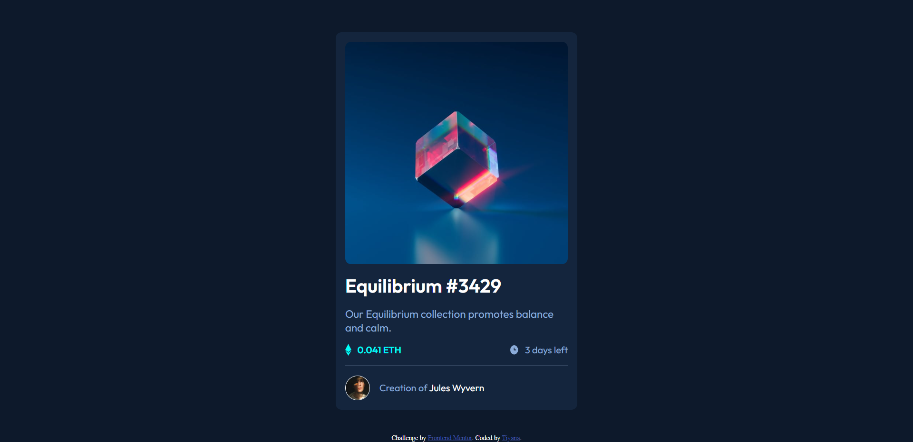
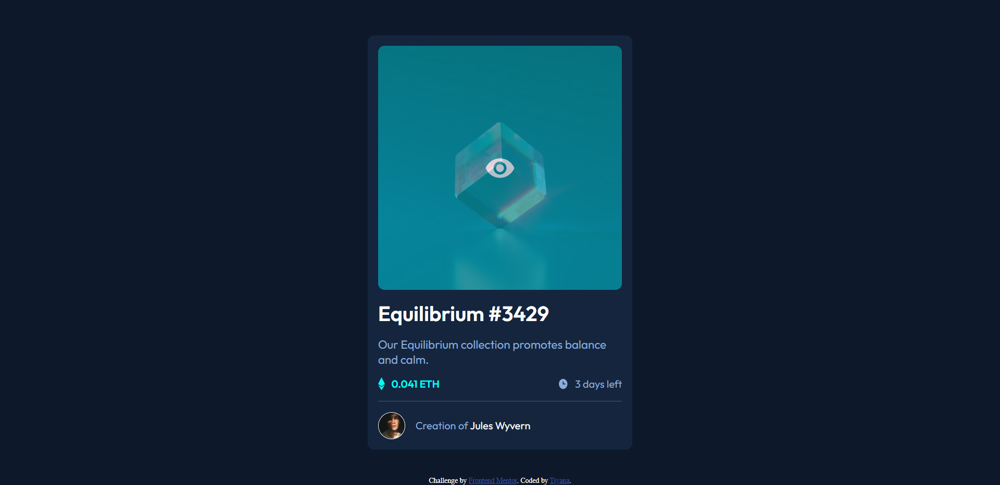

# Frontend Mentor - NFT preview card component solution

This is a solution to the [NFT preview card component challenge on Frontend Mentor](https://www.frontendmentor.io/challenges/nft-preview-card-component-SbdUL_w0U). Frontend Mentor challenges help you improve your coding skills by building realistic projects.

## Table of contents

- [Overview](#overview)
  - [Screenshot](#screenshot)
  - [Links](#links)
- [My process](#my-process)
  - [Built with](#built-with)
  - [What I learned](#what-i-learned)
  - [Continued development](#continued-development)
- [Author](#author)
- [Acknowledgments](#acknowledgments)

### Screenshot

Active State of Card

### Links

- Solution URL: [Add solution URL here](https://github.com/Tiyana19/NFT-preview-card)
- Live Site URL: [Add live site URL here](https://tiyana19.github.io/NFT-preview-card/)

## My process

### Built with

- Semantic HTML5 markup
- CSS custom properties
- Flexbox

### What I learned

I have used the flex property that I learned in my last project. I got to know about using background property and image on same element.
I learn about giving my img `display: block;` CSS because it is an inline element and it helps me understand where that space under the image comes from.

### Continued development

I will try to work more with max and min property.

## Author

- Frontend Mentor - [@Tiyana19](https://www.frontendmentor.io/profile/Tiyana19)

## Acknowledgments

Special thanks to:

- Frontend Mentor - [@visualdenniss](https://www.frontendmentor.io/profile/visualdenniss)

- Frontend Mentor - [@Petrosdevri](https://www.frontendmentor.io/profile/Petrosdevri)

They helped me lot in my last project and I was able to use that knowledge in this project.
